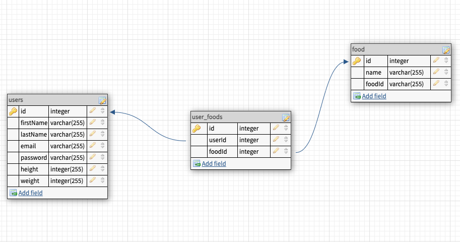

# Calorie-Tracker-BE
Solo Project 2 (Backend)

## Calorie Tracker App
**Calorie tracker is an app that helps users to keep track of their daily calorie intake.**

## About this app
How much you eat matters more than what you eat when it comes to losing weight or building muscles. It is vital to keep track of daily calorie intake and macro nutrients(Carbs, Fat, Protein). With this app, tracking food is fast and easy with this app.

## Wireframes

Click to see wireframes

## User Story

- When user loads the first page, user sees login, signup buttons
- User creates profile with name, email, password, username, sex, height, and weight.
- When user logs in, dashboard(account editor, calorie log), signout link are shown, user is redirected to a new page where they can search, create, save meals(breakfast, lunch, dinner).
- User can edit/delete account in account editor tab.
- User can search food for nutrition information – nutrition information will be shown.
- User can save nutrition information and, create and save meals.
- User can edit/delete their saved meals
## ERD

## HTTP Routes
[Users]
| Method | Path                   | Purpose                     |
|--------|------------------------|-----------------------------|
| GET    | /users/:id             | Get user profile info       |
| GET    | /users/:userId/getfood | Get saved food from user    |
| POST   | /users                 | Sign-up                     |
| POST   | /users/login           | Log-in                      |
| PUT    | /users/:id/edit        | Edit user profile info      |
| DELETE | /users/:id             | Delete user account         |
| DELETE | /users/:userId/delete  | Delete saved food from user |

[Foods]
| Method | Path                   | Purpose                         |
|--------|------------------------|---------------------------------|
| GET    | /food/search/:foodname | Get food info from external api |
| POST   | /food/:userId/save     | User can save food              |

## MVP checklist 
- Can user sign up, sign in and sing out?
- Can user get nutrition information?
- Can user save and delete nutrition info?
- Can user see saved nutrition info?

## Stretch goals
- User can delete their account.
- User can see their daily calorie goals and the remainder of it.
- User can create meals with saved food. 

## Work flow

Click to see 

1. Work on backend and frontend synchronously<
2. Framework with frontend HTML, CSS
3. Setup (npm i, sequelize i, etc)
4. Make database(sequelize db:create, sequelize db:migrate), add constraints/validations, associations
5. Set server.js and run servers in both frontend and backend.
6. Controllers and Routers
7. CRUD 
     
[Create]

    - Signup
    - Signin
    - Save food info        
    
[Read]

    - User profile info
    - Saved food from user 
    - axios request 
    
[Update]

    - user profile info edit
    
[Delete]

    
    - Delete user account
    - Delete saved food

8. Signout functionality
9. Styling up browser with HTML, CSS

